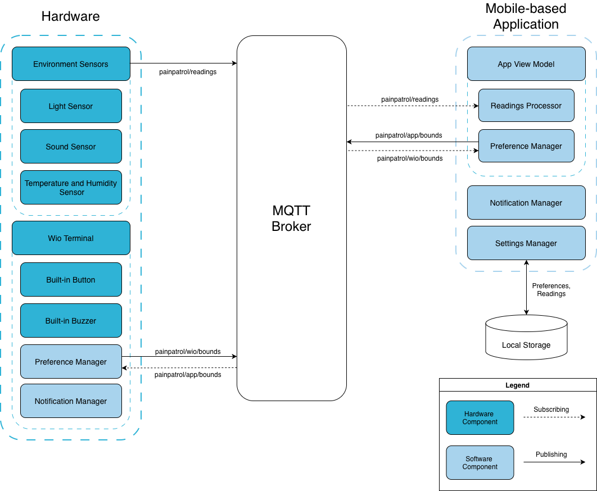

# Pain Patrol
## Overview
A system for chronic migraine sufferers which tracks light, sound, temperature, and humidity conditions and provides an evaluation of these conditions to aid the user in avoiding migraine triggers. The system allows customisation of comfortable environmental value ranges, and alerts the user when the readings are outside of the comfortable range. The mobile application allows the user to view graphs of environmental readings from a customisable timeframe.
### Demo
In order to see how the application is used, view our [video](https://youtu.be/-NR6YS6pn7E)

## Getting Started
### Prerequisites
- Computer
- Wio Terminal with sensors listed in [Hardware Specification](#hardware-specification)
- [Wio Terminal Chassis Battery](https://wiki.seeedstudio.com/Wio-Terminal-Chassis-Battery_650mAh/)
- [Git](https://git-scm.com/)
- [Android Studio](https://developer.android.com/studio)
- [Arduino IDE](https://docs.arduino.cc/software/ide/)

### Installation and Building
1. Clone the repository

2. 

Setup your hardware

    - Attach your Chassis Battery to your Wio Terminal
    
    - Attach the light sensor to interface A0
    - Attach the temperature and humidity sensor to interface D2
    - Attach the sound sensor to interface A6

3. 

Setup your Arduino IDE

    - Navigate to "Boards manager"
        - Install "Arduino AVR Boards"
        - Install "Seeed SAMD Boards"
    - Navigate to "Library manager"
        - "Grove Temperature And Humidity Sensor"
        - "PubSubClient"
        - "Seeed Arduino FS"
        - "Seeed Arduino RTC"
        - "Seeed Arduino SFUD"
        - "Seeed Arduino rpcUnified"
        - "Seeed Arduino rpcWiFi"
        - "Seeed_Arduino_mbedtls"
        - "ArduinoJson"
        - "lvgl"

4. Import the project into Android Studio and build the project

5. Connect your Wio Terminal to your computer in order to boot the Wio Terminal up

## System Architecture

## System Description
### Wio Terminal
The Wio Terminal measures sound intensity, lighting intensity, and the temperature and humidity of the room the user is currently in. These measurements are displayed on the Wio Terminal and sent to the Android Application through an MQTT broker. The Wio Terminal may also publish user defined uncomfortable ranges for individual sensors if the default ranges do not fit the user.

The Wio Terminal also receives user defined uncomfortable ranges for individual sensors from the Android Application through an MQTT broker.

Should the measurements exceed the ranges, the Wio Terminal will emit a noise through the built-in buzzer to alert the user about their environment not being suitable for them.
#### Hardware Specification
- [Wio Terminal](https://wiki.seeedstudio.com/Wio_Terminal_Intro/)
- [Grove - Temperature and Humidity Sensor](https://wiki.seeedstudio.com/Grove-TemperatureAndHumidity_Sensor/)
- [Grove - Sound Sensor](https://wiki.seeedstudio.com/Grove-Sound_Sensor/)
- [Grove - Light Sensor](https://wiki.seeedstudio.com/Grove-Light_Sensor/)
- [Wio Terminal Chassis Battery](https://wiki.seeedstudio.com/Wio-Terminal-Chassis-Battery_650mAh/)

### Android Application
The Android Application displays statistics of every sensor's readings on a chart. It also provides live readings of the sensor values.

The user is also notified about an unsuitable environment through a push notification.

Should the user feel like changing their acceptable ranges for the sensor's values, they can either do so in the settings section of the app or by marking the sensors manually in the live readings section.

### Software Specification
- Android application
    - built using Gradle
    - developed with the Java JDK v25 in Android Studio
- Wio Terminal application
    - developed and compiled using Arduino IDE
- Version control done through Git
- Repository hosting, management of the project done through GitLab

## Contributors

[Streetzy](https://github.com/streetzy), [Belina](https://github.com/beIina), [Aleks](https://github.com/axcts), [Kasia](https://github.com/katswiatowska), [Andros](https://github.com/Andros18)
